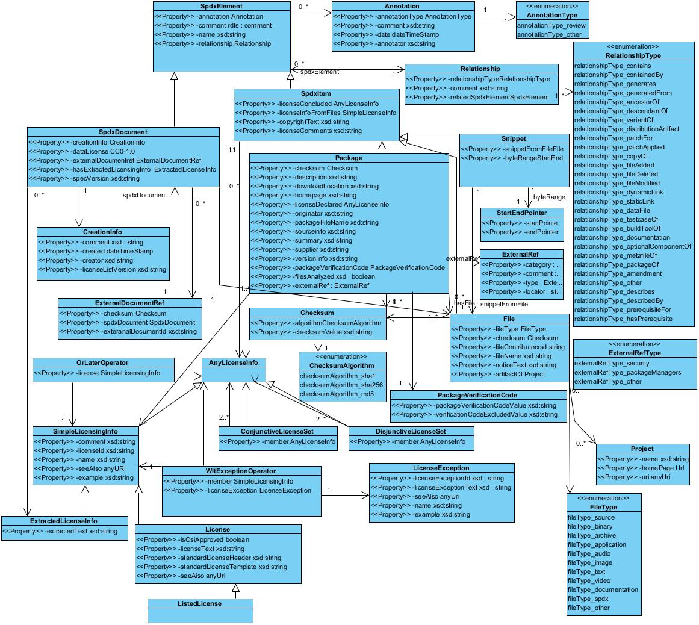

# Appendix III: RDF Data Model Implementation and Identifier Syntax

SPDX ® Vocabulary Specification

See: [http://spdx.org/rdf/ontology/spdx-2-2](http://spdx.org/rdf/ontology/spdx-2-2)

Version: 2.2



Licensed under the [Creative Commons Attribution License 3.0 Unported](http://creativecommons.org/licenses/by/3.0/).

## Agent and Tool Identifiers
Fields that identify entities that have acted in relation to the SPDX file are single line of text which name the agent or
tool and, optionally, provide contact information. For example, "Person: Jane Doe (jane.doe@example.com)",
"Organization: ExampleCodeInspect (contact@example.com)" and "Tool: LicenseFind - 1.0". The exact syntax of agent and tool identifications is described below in [ABNF](http://tools.ietf.org/html/rfc5234).

```text
agent            = person / organization

tool             = "Tool: " name 0*1( " " DASH " " version)

person           = "Person: " name 0*1contact-info

organization     = "Organization: " name 0*1contact-info

name             = 1*( UNRESERVED ) / U+0022 1*( VCHAR-SANS-QUOTE ) U+0022

contact-info     = " (" email-addr ")"

email-addr       = local-name-atom *( "." local-name-atom ) "@" domain-name-atom 1*( "." domain-name-atom )

version          = 1*VCHAR-SANS-QUOTE

local-name-atom  = 1*( ALPHA / DIGIT /    ; Printable US-ASCII
                       "!" / "#" /        ;  characters not including
                       "$" / "%" /        ;  specials.
                       "&" / "'" /
                       "*" / "+" /
                       "-" / "/" /
                       "=" / "?" /
                       "^" / "_" /
                       "`" / "{" /
                       "|" / "}" /
                       "~" )

domain-name-atom = 1*( ALPHA / DIGIT / "-" )

DASH             = U+2010 / U+2212 /   ; hyphen, minus, em dash and
                   U+2013 / U+2014     ;  en dash


UNRESERVED       = U+0020-U+0027 /     ; visible unicode characters
                   U+0029-U+0080 /     ;  except '(' and dashes
                   U+00A0-U+200F /
                   U+2011-U+2027 /
                   U+202A-U+2211 /
                   U+2213-U+E01EF


VCHAR-SANS-QUOTE = U+0020-U+0021 /  ; visible unicode characters
                   U+0023-U+0080 /  ;  except quotation mark
                   U+00a0-U+E01EF
```
