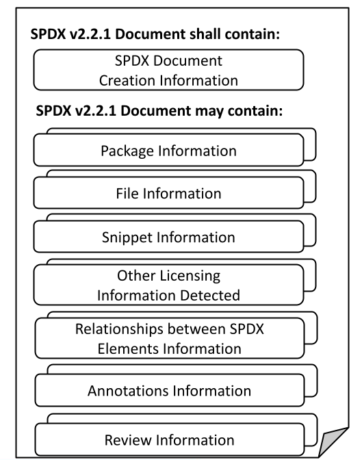

# 5 Composition of an SPDX document

## 5.1 What this specification covers 

This document contains the specification for an SPDX document, which is made up of a set of one or more sections, instances of which contain information in the form of *fields*. The following subclauses introduce the different kinds of sections allowed. The fields for each kind of section are defined in the clause corresponding to that section.  Within an SPDX document, sections may be organized, as follows:

The object model is illustrated by [Annex C](RDF-object-model-and-identifier-syntax.md).

## 5.2 Sections 

### 5.2.1 SPDX document creation information section 

An instance of this section provides the necessary information for forward and backward compatibility for processing tools.

One instance shall be present for each SPDX document produced. 

Cardinality: Mandatory, one.

See [Clause 6](document-creation-information.md) for details of the fields in this kind of section.

### 5.2.2 Package information section 

If SPDX information is being used to describe packages, then one instance of the Package Information per package being described shall exist.  It provides important meta information about the package as a whole.  Packages are an abstract concept that can be used to refer to any distribution of software, typically consisting of one or more files and capable of containing sub-packages.  Starting with SPDX 2.0, it is not necessary to have a package wrapping a set of files.

A Package refers to any unit of content that can be associated with a distribution of software. Typically, a Package is composed of one or more files. An SPDX document may, but is not required to, provide details about the individual files comprising a Package (see [Clause 8](file-information.md)).

Any of the following non-limiting examples may be (but are not required to be) represented in SPDX as a Package:

* a tarball, zip file or other archive
* a directory or sub-directory
* a separately-distributed piece of software which another Package or File uses or depends upon (e.g., a Python package, a Go module, ...)
* a container image, and/or each image layer within a container image
* a collection of one or more sub-packages
* a Git repository snapshot from a particular point in time

Note that some of these could be represented in SPDX as a File as well.

In an SPDX document, Relationship elements can be used to indicate relationships between Packages, such as dependency relationships.

Cardinality: Optional, one or many.

See [Clause 7](package-information.md) for details of the fields in this kind of section.

In `tag:value` format, the order in which package and files occur is syntactically significant.

* A new Package Information section is denoted by the Package Name ([7.1](package-information.md#7.1)) field.
* All Package Information fields shall be grouped together before the start of a Files section ([Clause 8](file-information.md)), if file(s) are present.
* All files contained in a package shall immediately follow the applicable Package Information.
* A new Package Information section (via Package Name) denotes the start of another package.
* Sub-packages shall not be nested inside a Package Information section, but shall be separate and shall use a Relationship to clarify.
* Annotations and Relationships for the package may appear after the Package Information before any file information.

### 5.2.3 File information section 

One instance of the File Information shall exist for each file in the software package. It provides important meta information about a given file including licenses and copyright. Starting with SPDX 2.0, it is not necessary to have a package wrapping a set of files.

Cardinality: Optional, one or many.

See [Clause 8](file-information.md) for details of the fields in this kind of section.

When implementing `tag:value` format, the positioning of File elements is syntactically significant:

* Files are assumed to be associated with the Package Information that immediately precedes it, if a package exists.
* Presence of a new Package Information signals the end of the set of files associated with the preceding package, unless an explicit Relationship is used.
* If a package contains files, the File Information sections shall follow its Package Information section.
* If a File is not part of any package, it shall precede any Package Information section reference in the SPDX document.
* The first field to start off the description of a File shall be the File Name in `tag:value` format.
* File information is associated with the File Name that precedes it.
* Annotations on the file and Relationships from the file may appear after the file information, before the next file or Package Information section.

When implementing file information in RDF, the `spdx:hasFile` property is used to associate the package with the file.

### 5.2.4 Snippet information section 

Snippets can optionally be used when a file is known to have some content that has been included from another original source. They are useful for denoting when part of a file may have been originally created under another license.

Each instance of Snippet Information shall be associated with a specific file in an SPDX document.

Cardinality: Optional, one or many.

See [Clause 9](snippet-information.md) for details of the fields in this kind of section.

When implementing `tag:value` format, the positioning of Snippet elements is syntactically significant:

* If a File contains Snippets, the Snippet Information section shall follow a related File Information section (if it exists in the document).
* Presence of a new file or package section signals the end of the set of snippets associated with the original file, unless an explicit Relationship is used.
* The first field to start off the description of a Snippet shall be the Snippet Identifier in `tag:value` format.
* Annotations on the Snippet and Relationships from the Snippet may appear after the Snippet Information, before the next file or Package section.

### 5.2.5 Other licensing information detected section 

This section is used for any detected, declared or concluded licenses that are NOT on the SPDX License List. For the most up-to-date version of the list, see [https://spdx.org/licenses/](https://spdx.org/licenses/). The SPDX License List can also be found in [Annex A](SPDX-license-list.md).

One instance shall be created for every unique license or licensing information being referenced that does not match one of the licenses on the SPDX License List. 

Cardinality: Optional, one or many.

See [Clause 10](other-licensing-information-detected.md) for details of the fields in this kind of section.

### 5.2.6 Relationships between SPDX elements information section 

Packages, files, and snippets are all considered to be SPDX Elements, and relationships can be made explicit between these SPDX elements by using the fields in this section. 

Cardinality: Optional, one or many.

See [Clause 11](relationships-between-SPDX-elements.md) for details of the fields in this kind of section.

### 5.2.7 Annotations information section 

Annotations permit the addition of information to validate and clarify ambiguous SPDX Elements (Packages, Files or Snippets).

Cardinality: Optional, one or many.

See [Clause 12](annotations.md) for details of the fields in this kind of section.

This section is now the preferred home for review information.

### 5.2.8 Review information section 

The review information section is included for compatibility with SPDX 1.2, and is deprecated since SPDX 2.0. Any review information shall use an Annotation (as described in [Clause 12](annotations.md)) with an annotation type of `REVIEW`.

Review information may be added after the initial SPDX document has been created. The set of fields are optional and multiple instances may be added. Once a Reviewer entry is added, the Review Date associated with the review is mandatory. The Created date shall not be modified as a result of the addition of information regarding the conduct of a review. A Review Comments is optional.

See [Clause 13](review-information-deprecated.md) for details of the fields in this kind of section.

## 5.3 What this specification does not cover 

This document does not address the following:

* Information that cannot be derived from an inspection (whether manual or using automated tools) of the package to be analyzed.
* How the data stored in an SPDX document is used by the recipient.
* Any identification of any patent(s) which may or may not relate to the package.
* Legal interpretation of the licenses or any compliance actions that have been or may need to be taken.
