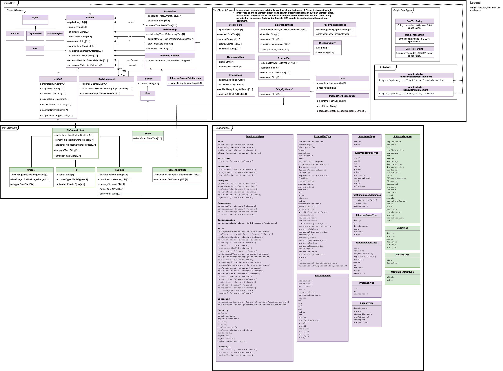
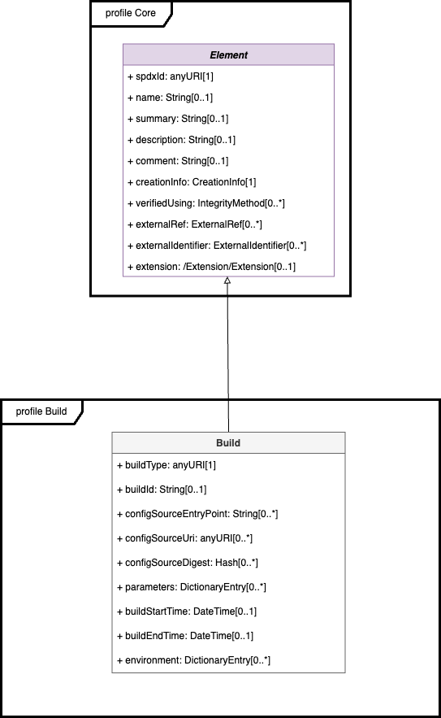
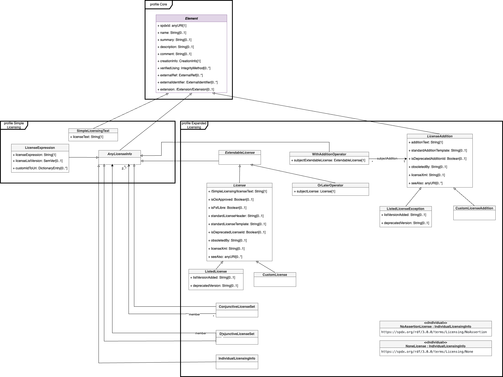

# Annex B: RDF object model and identifier syntax (Normative)

TODO: update for SPDXv3

## B.1 Introduction 

SPDX ® Vocabulary Specification

[SPDX 3.0.1 Model SHACL](https://spdx.org/rdf/3.0.1/spdx-model.ttl)

Version: 3.0.1

