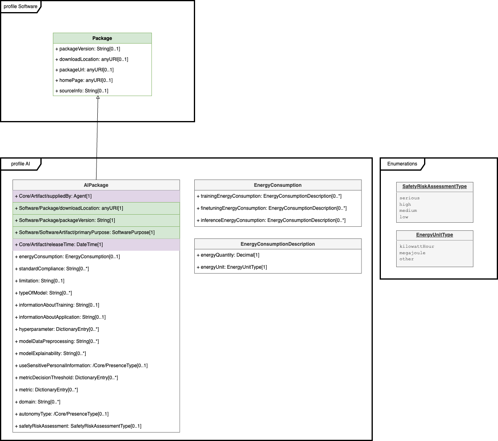

# Annex C: RDF object model and identifier syntax (Normative)

TODO: update for SPDXv3

## C.1 Introduction 

SPDX ® Vocabulary Specification

[SPDX 3.0 Model SHACL](https://spdx.org/rdf/3.0.0/spdx-model.ttl)

Version: 3.0

