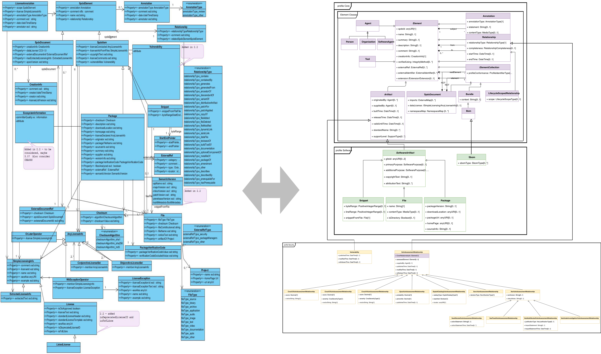

# Annex F: History, Motivation and Rational

(Informative)

The OMG and CISQ involvement in developing this specification had its start due
to a need that came from the several years of work in the Department of
Commerce’s National Telecommunications and Information Administration (NTIA) in
creating an Initiative to Improve Software Component Transparency in July of
2018 [6]. That effort actually was the culmination of several earlier attempts
to get software transparency, updatability and bill of materials as
requirements in safety critical sectors like automotive and healthcare as early
as 2013/2014 [2, 3] with many talks and papers written for and against them and
discussions. With the launch of the NTIA Software Component Transparency
Initiative there was a major increase in the energy and coordination of those
proposing Software Bill of Materials (SBOM) as a key element of communication
across the different participants in software supply chains.
These meetings, which started with a public meeting in Washington DC consisted
primarily of vendors of software and customers of those vendors.
It was this mix of participants that struck us that these efforts were missing
an important community member if they were to make SBOMs successful and useful
– they seemed to be missing the organizations who create the tools for
developing software.

To address this gap, over the winter and spring of 2019, we crafted a market
analysis of the software development tooling ecosystem and documented usage
scenarios to drive the functionality needed for an SBOM standard usable by
tools to talk to other tools and bring speed and agility into the discussion of
software transparency and assurance about the information itself. This
information was used to present to the Systems Assurance Platform Task Force
(PTF) and the Architecture Driven Modernization PTF in March and June of 2019.
The paper “Standardizing SBOM within the SW Development Tooling Ecosystem”,
which captured this work, was later published by MITRE [1] and included 8 core
usage scenarios for SBOMs as well as a discussion of the various roles were in
the software creation tooling ecosystem. This paper and its various
pre-publication drafts were used as a discussion starter to garner interest and
participation in the Tool-to-Tool (3T) Software Bill of Materials Exchange
effort [4]. The 3T-SBOM Exchange effort was co-sponsored by CISQ and OMG and
launched in the fall of 2019 with three to four weekly meetings working the
various facets of SBOMs. Over the next two years the 3T-SBOM community, which
included over 30 organizations that develop and integrate software creation
tooling and infrastructure, developed a 3T-SBOM core model (shown in Figure 13)
in September of 2020 that had seven basic concepts connected together to
address the usage scenarios outlined for the project.

")
**Figure 13 – 3T-SBOM draft core model (circa Sep 2020)**

While the 3T-SBOM community was working to develop their model, the work within
the NTIA Software Component Transparency effort also met in numerous weekly
virtual meetings to discuss the various aspects of SBOMs, their use, the roles
of different players in the lifecycle of an SBOM and the need to educate the
world about SBOMs. This was captured in the NTIA Software Bill Of Materials
web page. [7]

In late 2020 and much of 2021 the world of software security turned its
attention to the software supply chain attack on the Solar Winds Corporation
[5] and the need to prevent similar types of attacks in the future. The United
States Government responded to this and other similar attacks by issuing
Executive Order 14028 in May 2021 [12] calling for stronger software security
practices for products used by the government and that the software have SBOMs
with them. The Executive Order required that “Within 60 days of the date of
this order, the Secretary of Commerce, in coordination with the Assistant
Secretary for Communications and Information and the Administrator of the
National Telecommunications and Information Administration, shall publish
minimum elements for an SBOM.” This was done leveraging the community work that
NTIA had been doing with industry for the past 34 months and set the new
requirements for SBOM capabilities. [11]

Over the 2019-2020 timespan, some of the organization in the 3T-SBOM community
were also working within the Linux Foundation’s Software Package Data Exchange
(SPDX®) open-source effort to evolve their previous work. Started in 2010 to
help organizations developing software that planned to incorporate open source
software make sure that the licenses for that open source software were
appropriate for how the organizations planned to use them in their own
offerings, the SPDX community developed a series of software products,
specifications, and capabilities to address this area. The first published work
was a version 1.0 specification in August of 2011; followed by 1.1 version a
year later; a 1.2 version in October 2013; a 2.0 version in 2015; and 2.1
version in 2016. The 2.1 version of SPDX was published through the Linux
Foundation’s new Joint Development Foundation and sent to ISO under the
Publicly Available Standard (PAS) process with it eventually being republished
as “ISO/IEC 5962:2021 - Information technology — SPDX®” in 2021.

Through the common members in 3T-SBOM and the Linux Foundation’s SPDX effort
many of the concepts around SBOMs flowed back and forth between the two
resulting in a draft core model for SPDX 3.0 in September of 2020 that had the
same seven basic concepts connected together that were in the 3T-SBOM core
model. Figure 14 shows the state of the SPDX 3.0 core model at that time.

")
**Figure 14 – SPDX 3.0 draft core model (circa Sep 2020)**

The similarities and alignment of the two group’s work (shown in Figure 15
below) was brought to the attention of both teams and after long discussions
about each other’s efforts, goals, and approach to creating a standard for
today, both agreed in principle to join together under the SPDX 3.0 label but
to make several changes in the way the SPDX community activities were run as
well as how the resulting specification would be vetted.

")
**Figure 15 – Correspondence between 3T-SBOM and SPDX 3.0 draft models (circa
Sep 2020)**

Specifically, the SPDX community revised their charter to align with the
processes of a Standards Development Organization, electing new chairs and
adding the OMG Architecture Board review as a gating factor in the publication
of SPDX 3.0 and subsequent versions.

The merged activities of the two group slid together the beginning weeks of
2021 with activities generally moving forward but occasionally stalling while
the larger group worked through issues that one or the other hadn’t discussed
or had a different opinion about. Eventually, after releasing SPDX 2.3 in
August of 2022 with updates that brought some of the concepts and capabilities
slated for SPDX 3.0 to the community in preparation of the shift that SPDX 3.0
represents, the first release candidate of SPDX 3.0 was released in May of
2023. Within the SPDX community, which is both a standards creation
organization as well as a community of open source developers, a release
candidate offers an opportunity for implementors of SPDX, both new and old, to
review the work and determine whether there were parts that were unclear or
that would be extremely burdensome to implement.

Based on the comments and change requests from the initial candidate release
several areas of the model were revised and reworked, resulting in a release
candidate 2 of SPDX 3.0 in February of 2024. This release candidate will give
tool creators and those who maintain the support libraries for working with
SPDX time to start revising their projects in advance of the final version of
the specification. For those not following the inner workings, debates, and
discussion of the combined 3T-SBOM and SPDX 3.0 working group for the last 3
years there will be a dramatic change in the SPDX model as it goes from SPDX
2.3 to SPDX 3.0, as shown by looking at Figure 16’s left-side (SPDX 2.3 model)
compared to its right-side (SPDX 3.0), shifting the SPDX name from Software
Package Data eXchange to System Package Data eXchange and the scope of items it
can convey in a bill of materials.

**Figure 16 – SPDX 2.3 Model compared to the SPDX 3.0 Model**

The SPDX 3.0 model is available at:
<https://github.com/spdx/spdx-3-model>

The SPDX 3.0 ontology is available at:
<https://github.com/spdx/spdx-spec/tree/development/v3.0/ontology>

The SPDX 3.0 specification is available as web pages at:
<https://spdx.github.io/spdx-spec/v3.0/>
